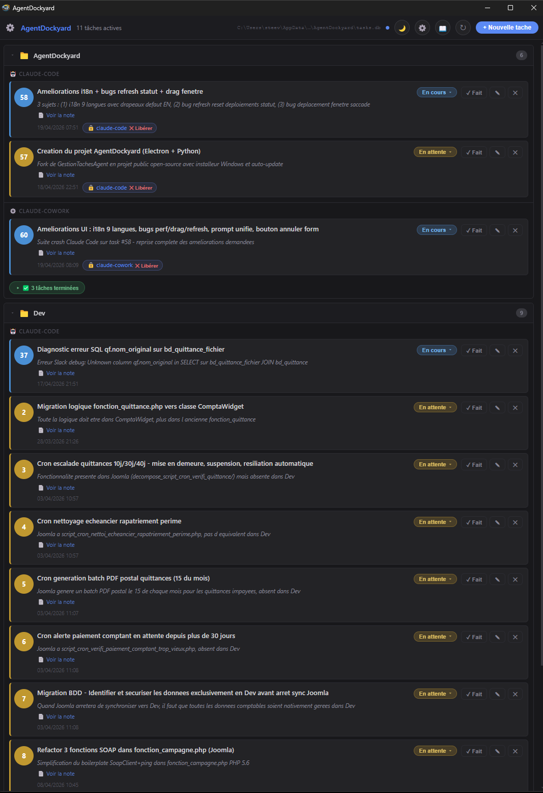
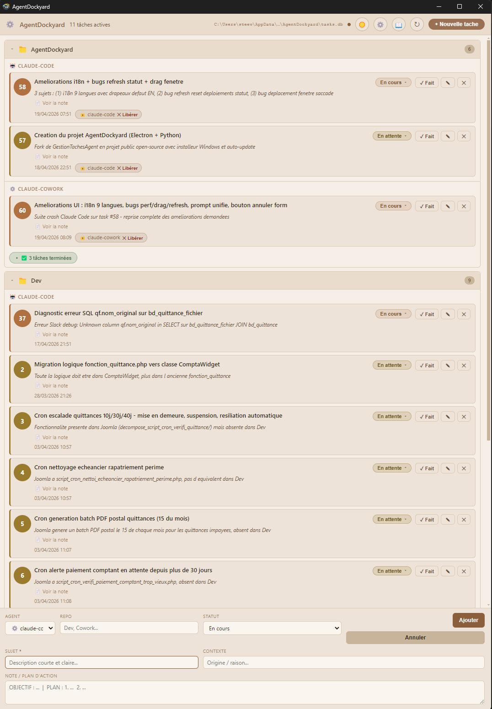

# AgentDockyard

<p align="left">
  <a href="https://github.com/steevec/agentdockyard/releases/latest"></a>
  <a href="https://github.com/steevec/agentdockyard/releases"></a>
  <a href="LICENSE"></a>
  
  <a href="https://github.com/steevec/agentdockyard/issues"></a>
</p>

**A local task hub for AI coding agents.**

AgentDockyard helps you keep track of what your AI agents are doing **without reopening every session**.

It works when you have **many different agents** working together, but also when you have **just one agent spread across many sessions**.
You can immediately see what is **in progress**, **blocked**, **waiting**, **done**, and **who claimed what**.

Install the app, copy the prompt snippet shown in the built-in guide, paste it into your agent memory, and you're done. After that, your agents can create, update, claim, delegate, and close tasks on their own.

> Local-first. No cloud dashboard. No account. No telemetry.
> By [Steeve Cordier](https://sitecrea.fr/) — MIT License.

---

<p align="center">
  
</p>

## Why this exists

When you run several AI sessions in parallel, the real problem is not generating code.
It is **remembering the state of the work**.

Questions pile up fast:

- Which session is still working on something?
- Which task is blocked and needs input?
- Which task is finished already?
- Which agent already picked up that item?
- What did the overnight or scheduled agent actually do?

AgentDockyard gives you one local dashboard for all of that.

It is especially useful for:

- solo developers running **one agent in many parallel sessions**
- developers juggling **Claude Code, Claude Cowork, Codex, Copilot, scripts, or scheduled jobs**
- setups where **one agent supervises and delegates work** while others execute it
- workflows where you want a **shared, lightweight task hub** instead of a full SaaS project tool

---

## In 30 seconds

1. **Install AgentDockyard on Windows**
2. Open **Settings / Guide** and copy the prompt snippet + executable path prepared by the app
3. Paste that snippet into the memory or system instructions of your AI agents

From there, the agents can report work automatically with a one-line CLI call:

```bash
"C:\Program Files\AgentDockyard\resources\agent.exe" "{\"action\":\"ajouter\",\"agent\":\"claude-code\",\"repo\":\"my-project\",\"sujet\":\"Fix checkout bug\",\"statut\":\"en_cours\"}"
```

That is the whole idea: **minimal setup, then autonomous tracking**.

---

## What makes it different

### Useful even with only one agent

Most task tools assume a team.

AgentDockyard also makes sense when you are alone but running the same agent in multiple terminals, branches, or scheduled sessions.
Instead of reopening each conversation to remember what was happening, you get one consolidated view.

### Agents can coordinate through it

One agent can create or dispatch a batch of tasks.
Another agent can pick up a waiting task, update progress, add notes, or close it.

That makes AgentDockyard useful not only as a personal dashboard, but as a **small local coordination layer between agents**.

### No heavy integration work

There is no need to build a backend, host a service, or wire a cloud API before it becomes useful.

The intended workflow is simple:

- install the desktop app
- copy the prompt snippet suggested by the app
- paste it into your agent memory
- let the agents write to the task hub automatically

---

## Typical workflows

### 1) One agent, many sessions

You have 6 Claude Code sessions open across multiple repos.
Each session creates and updates tasks as it works.
You keep one clean overview of what is still active, what is blocked, and what is already done.

### 2) One supervisor agent, several executor agents

A planning or supervisor agent breaks down a migration into subtasks.
Other agents pick up the waiting items and move them forward.
You can see delegation, claims, progress, and completion from one place.

### 3) Overnight or scheduled work

A scheduled agent runs during the night or while you are away.
In the morning, you do not need to inspect logs or reopen sessions first: the dashboard already shows what was created, updated, blocked, or completed.

---

## Screenshots

<p align="center">
  
</p>

<p align="center">
  
</p>

Dark and light themes are both available in the app.

---

## Core features

- **Single local dashboard** for tasks created by AI agents
- **Real-time refresh** when agents write to the shared SQLite database
- **Grouped view by repository and agent**
- **Clear statuses**: urgent, in progress, waiting, blocked, cancelled, done
- **Claim system** to show who owns a task right now, with expiry support
- **Notes and context on each task** so the next session can understand the state quickly
- **Dark and light themes**
- **Built-in guide panel** with ready-to-paste prompt instructions
- **Editable agents list** for custom agents, scripts, and identities
- **100% local storage** with SQLite + local config
- **No telemetry, no account, no SaaS dependency**
- **Auto-update through GitHub Releases** (can be disabled)

---

## Install

### Windows

1. Download **`AgentDockyard-Setup-x.y.z.exe`** from the [latest release](https://github.com/steevec/agentdockyard/releases/latest)
2. Install it normally
3. Launch AgentDockyard
4. Open the built-in guide or settings panel to get the executable path and the prompt snippet for your agents

A **portable** build is also available as `AgentDockyard-Portable-x.y.z.exe`.

The installer is currently **unsigned**, so Windows SmartScreen may ask for confirmation on first launch.

### macOS / Linux

Not packaged yet.
The desktop release flow currently targets Windows, but the underlying idea and CLI usage are not Windows-only.

---

## Connect your agents

Inside the app, open the **Guide** panel.

You will find copy-ready instructions for integrating AgentDockyard with your agent memory or system prompt.
The app also exposes the path to the bundled executable so you do not have to guess it.

Typical examples include:

- Claude Code
- Claude Cowork
- Codex
- Copilot
- custom scripts
- scheduled automation jobs

Example commands:

```bash
# Create a task
"C:\Program Files\AgentDockyard\resources\agent.exe" "{\"action\":\"ajouter\",\"agent\":\"claude-code\",\"repo\":\"my-project\",\"sujet\":\"Fix bug X\",\"statut\":\"en_cours\"}"

# Update a task
"C:\Program Files\AgentDockyard\resources\agent.exe" "{\"action\":\"modifier\",\"id\":42,\"note\":\"Step 1 done, running tests\"}"

# Close a task
"C:\Program Files\AgentDockyard\resources\agent.exe" "{\"action\":\"cloturer\",\"id\":42,\"note\":\"Merged in PR #123\"}"
```

The full command reference lives in the app guide and in [`agent.py`](agent.py).

---

## Local HTTP API

AgentDockyard can also expose a minimal local HTTP API. It is useful for Claude Cowork, Linux sandboxes, another machine on the LAN, or scheduled jobs that cannot call `agent.exe` directly.

The HTTP API is only a bridge to the existing local agent. It does not add a cloud backend and it does not change the SQLite task format.

Default config:

```json
{
  "httpApi": {
    "enabled": true,
    "host": "127.0.0.1",
    "port": 17891,
    "token": ""
  }
}
```

Config file:

```text
%APPDATA%\AgentDockyard\config.json
```

Use `127.0.0.1` when the caller runs on the same Windows machine. Use `0.0.0.0` when Claude Cowork, a sandbox, or another LAN machine must reach the API through the Windows PC IP address. Restart AgentDockyard after changing this config.

If `token` is empty, no token is required. If it is set, callers must send:

```text
X-AgentDockyard-Token: YOUR_TOKEN
```

Health check:

```powershell
Invoke-RestMethod -Method Get -Uri "http://127.0.0.1:17891/health"
```

Create a task through HTTP:

```powershell
Invoke-RestMethod -Method Post `
  -Uri "http://127.0.0.1:17891/api/agentdockyard" `
  -ContentType "application/json" `
  -Body '{"action":"ajouter","agent":"claude-cowork","repo":"AgentDockyard","sujet":"Test HTTP local","statut":"en_cours","note":"Created through local HTTP API"}'
```

From a sandbox or another LAN machine:

```bash
curl http://IP_DU_PC_WINDOWS:17891/health

curl -X POST http://IP_DU_PC_WINDOWS:17891/api/agentdockyard \
  -H "Content-Type: application/json" \
  -d '{"action":"ajouter","agent":"claude-cowork","repo":"AgentDockyard","sujet":"Test HTTP from sandbox","statut":"en_cours","note":"Created without folder access"}'
```

Recommended prompt for HTTP-only agents:

```text
You can use AgentDockyard through its local HTTP API.
Base URL: http://IP_DU_PC_WINDOWS:17891

Use HTTP only:
- Do not ask for Windows folder access.
- Do not call agent.exe directly.
- Do not write to tasks.db directly.
- If the API is unreachable, continue the main work and mention the failure.
- Use short timeouts when you run curl from automation.

Mandatory workflow:
1. Create a task as soon as the work starts.
2. Keep the task note updated during meaningful steps.
3. Use changer_statut with bloque or en_attente when needed.
4. Close the task with a useful summary when the work is done.
5. If you detect a separate issue, create a new task for it.
```

Automation jobs should treat AgentDockyard as best-effort telemetry. If the API is unavailable, log the error and continue the main business process unless task tracking is the only purpose of that job.

---

## Statuses

| Value | Meaning |
|---|---|
| `a_faire_rapidement` | Needs attention first (shown as `Urgent` in the UI) |
| `en_cours` | Currently being worked on |
| `en_attente` | Waiting for another task, input, or timing |
| `bloque` | Blocked |
| `annule` | Cancelled |
| `fait` | Completed |

---

## Data, config, and privacy

Everything stays local.

- **Config**: `%APPDATA%\AgentDockyard\config.json`
- **Database**: `%APPDATA%\AgentDockyard\tasks.db`

There is no hosted dashboard and no required account.
Network access is only relevant for optional update checks against GitHub Releases.

---

## Architecture

```text
 ┌────────────────────────────────┐
 │  Renderer (HTML/CSS/JS)        │
 │  theme, panels, task cards     │
 └──────────┬─────────────────────┘
			│ IPC (preload bridge)
 ┌──────────▼─────────────────────┐                        ┌──────────────────────┐
 │  Electron main (main.js)       │ ─── spawnSync ───────► │  agent.exe (bundled) │
 │  window, config, updater       │                        │  PyInstaller bundle  │
 └──────────┬─────────────────────┘                        └──────────┬───────────┘
			│ fs.watch(tasks.db)                                       │
			│                                                          ▼
			└── notifies renderer on external write ───────────── tasks.db (SQLite)
																	   ▲
								external AI agents call agent.exe  ────┘
								(Claude Code, Cowork, Copilot, ...)
```

- **Electron renderer**: dashboard UI
- **Electron main**: window lifecycle, config JSON, multi-screen placement, auto-updater, DB watching, optional local HTTP API
- **`agent.exe`**: standalone CLI used by agents to read and write tasks
- **HTTP API**: optional local bridge that forwards JSON payloads to the same agent mechanism
- **`tasks.db`**: local SQLite task store

---

## Build from source

### Prerequisites

- **Node.js 20+**
- **Python 3.8+** with `pip install pyinstaller` to build `agent.exe`
- **Windows** for the packaged desktop build flow

### Commands

```bash
git clone https://github.com/steevec/agentdockyard.git
cd agentdockyard
npm install
npm start
npm run build:agent
npm run build
```

Artifacts land in `dist/`:

- `AgentDockyard-Setup-x.y.z.exe`
- `AgentDockyard-Portable-x.y.z.exe`
- `latest.yml`

See [CONTRIBUTING.md](CONTRIBUTING.md) for local development details.

---

## FAQ

**Do I need Python installed to use the app?**
No. End users use the bundled `agent.exe`. Python is only needed if you rebuild from source.

**Is this only useful for teams of agents?**
No. One of the main use cases is exactly the opposite: one developer, one main agent, many sessions.

**Does it send data to the cloud?**
No. Tasks and config stay local. Only update checks may contact GitHub Releases.

**Can different kinds of agents use it?**
Yes. It is designed for mixed setups: Claude Code, Claude Cowork, Codex, Copilot, scripts, or scheduled jobs.

**Can one agent create tasks for another?**
Yes. That is one of the intended workflows.

**Why not just use a TODO app?**
Because the point here is not generic project management. The point is giving AI agents a very small shared protocol so they can create, update, and close work items autonomously.

---

## Contributing

Bug reports, ideas, and pull requests are welcome.
See [CONTRIBUTING.md](CONTRIBUTING.md) for local setup and conventions.

For security-sensitive topics, see [SECURITY.md](SECURITY.md).

---

## License

[MIT](LICENSE) © [Steeve Cordier](https://sitecrea.fr/)
