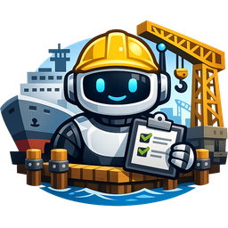

# AgentDockyard

**Supervise your AI agents tasks from a local desktop dashboard.**
Track in real time what Claude Code, Claude Cowork, Copilot, Codex (or any other AI agent) are doing on your projects - all stored 100% locally.

> By [Steeve Cordier](https://sitecrea.fr/) — MIT License



---

## Features

- **Real-time dashboard** - updates instantly whenever an agent writes to the shared database
- **Dark & Light themes** (neutral dark / warm beige)
- **Claim system** - know which agent is currently working on a task (with auto-expiry)
- **Built-in prompt guide** - copy-paste ready instructions for your AI agents (Claude Code, Cowork, Copilot, Codex…)
- **Full settings panel** - purge rules, refresh rate, window position on multi-screen setups, custom agents list…
- **100% local SQLite storage** - no cloud, no telemetry, no account
- **Auto-update** via GitHub Releases (opt-in)
- **Zero runtime dependencies** - the installer bundles everything (no Python or extra tools to install)

---

## Installation

### Windows (recommended)

1. Download `AgentDockyard-Setup-x.y.z.exe` from the [latest release](https://github.com/steevec/agentdockyard/releases/latest).
2. Run it - desktop + start-menu shortcuts are created automatically.
3. Launch AgentDockyard.

A **portable** edition is also available (`AgentDockyard-Portable-x.y.z.exe`) - no install, just run.

### From source (developers)

```bash
git clone https://github.com/steevec/agentdockyard.git
cd agentdockyard
npm install
npm start
```

Dev-only prerequisites: Node.js 18+, Python 3.8+, `pip install pyinstaller` (only needed if you want to build the packaged `.exe`).

---

## How to integrate your AI agents

Open AgentDockyard → click **📖 Guide** in the header → **Prompt IA** tab.
Copy the block matching your agent (Claude Code, Claude Cowork, Copilot…) and paste it into your agent's `CLAUDE.md` / system prompt. The path to the `agent.exe` bundled with your install is inserted automatically.

Example of what your agent can run from its shell:

```bash
# Claim a task
"C:\Program Files\AgentDockyard\resources\agent.exe" '{"action":"ajouter","agent":"claude-code","repo":"my-project","sujet":"Fix bug X","statut":"en_cours"}'

# Update
"C:\Program Files\AgentDockyard\resources\agent.exe" '{"action":"modifier","id":42,"note":"Step 1 done"}'

# Close
"C:\Program Files\AgentDockyard\resources\agent.exe" '{"action":"cloturer","id":42,"note":"Shipped in PR #123"}'
```

Full command reference is in the in-app guide.

---

## Architecture

```
 ┌────────────────────────────┐
 │  Renderer (HTML/CSS/JS)    │
 │  theme, panels, cards      │
 └──────────┬─────────────────┘
            │ IPC (preload bridge)
 ┌──────────▼─────────────────┐                       ┌──────────────────────┐
 │  Electron main (main.js)   │ ─── spawnSync ──────► │  agent.exe (bundled) │
 │  window, config, updater   │                       │  PyInstaller bundle  │
 └──────────┬─────────────────┘                       └──────────┬───────────┘
            │ fs.watch(tasks.db)                                  │
            │                                                     ▼
            └─────── notifies renderer on external write ───► tasks.db (SQLite)
                                                                  ▲
                              external AI agents call agent.exe ──┘
                              (Claude Code, Cowork, Copilot, ...)
```

`agent.exe` is a standalone PyInstaller binary: it ships inside the installer and needs **no Python** on the end-user machine. AI agents on the same machine invoke it by CLI to read/write the shared `tasks.db`.

`tasks.db` (and `config.json`) live under your OS user-data folder:
- **Windows**: `%APPDATA%\AgentDockyard\`
- **macOS**: `~/Library/Application Support/AgentDockyard/` (planned)
- **Linux**: `~/.config/AgentDockyard/` (planned)

---

## Building a release (maintainers)

```bash
# prerequisites (one-time)
npm install
pip install pyinstaller

# build everything (agent.exe + installer + portable)
npm run build

# publish to GitHub Releases (needs GH_TOKEN)
npm run publish
```

Artefacts land in `dist/`:
- `AgentDockyard-Setup-x.y.z.exe` — NSIS installer
- `AgentDockyard-Portable-x.y.z.exe` — portable
- `latest.yml` — used by `electron-updater` for auto-updates

---

## Philosophy

AgentDockyard was born to answer a simple question: **when I have several AI agents coding in parallel across my projects, what exactly is each one doing right now, and what did they finish?**

Built for a single developer's workflow, not a team / cloud product. If that matches how you work too, it might fit you.

---

## License

MIT © [Steeve Cordier](https://sitecrea.fr/)
